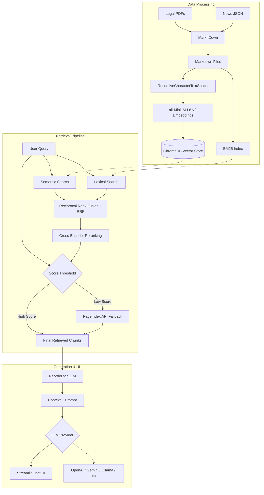

# Báo Cáo Nhóm - RAG Pipeline System

## Thành viên và Phân công
| Thành viên | MSSV | Nhiệm vụ | Trạng thái |
|-----------|------|----------|------------|
| Lê Quang Thọ | 2A202600597 | Thu thập/kiểm tra dữ liệu pháp luật, chuẩn hóa nguồn legal | Done |
| Phạm Mai Anh | 2A202600644 | Thu thập bài báo, kiểm tra metadata news và source documents | Done |
| Đỗ Trung Đức | 2A202600918 | Chunking, indexing, semantic search và lexical search | Done |
| Phạm Ngọc Hải Dương | 2A202600629 | Backend FastAPI, frontend chatbot, tích hợp generation có citation | Done |
| Vương Nguyệt Bình | 2A202600932 | Evaluation pipeline, golden dataset, A/B comparison | Done |
| Nguyễn Văn Sáng | 2A202600598 | QA demo, kiểm thử end-to-end, README và báo cáo kết quả | Done |

## Kiến trúc hệ thống (Tích hợp)



Hệ thống là sự kết hợp các chiến lược (strategies) tốt nhất từ bài tập cá nhân của các thành viên trong nhóm:

1. **Data Ingestion & Processing:**
   - Text extraction từ PDF (dữ liệu pháp luật) và Crawler JSON tự động (tin tức báo chí).
   - Chuẩn hóa toàn bộ dữ liệu về định dạng Markdown.

2. **Chunking & Indexing:**
   - Sử dụng `RecursiveCharacterTextSplitter` (size 500, overlap 50) để giữ ngữ cảnh pháp lý tốt nhất.
   - Embeddings với `all-MiniLM-L6-v2` và lưu trữ trong `ChromaDB`.

3. **Advanced Retrieval Pipeline:**
   - Đề xuất mô hình đa lớp: Semantic Search (Dense) song song với Lexical Search (BM25 - Sparse).
   - Gộp kết quả bằng thuật toán `RRF` (Reciprocal Rank Fusion) và `Cross-Encoder Reranking`.
   - **Fallback Logic** sang API `PageIndex` (Vectorless RAG) hoạt động thực tế khi query score quá thấp.

4. **Generation & UI:**
   - Áp dụng kỹ thuật `Reorder for LLM` để đưa chunk quan trọng lên đầu/cuối prompt tránh "lost-in-the-middle".
   - Hỗ trợ linh hoạt đa nền tảng LLM (OpenAI, Gemini, Anthropic, LiteLLM, Ollama, Grok, Nvidia NIM) cấu hình qua `.env`.
   - Giao diện người dùng Streamlit thân thiện.

5. **Evaluation Framework:**
   - Xây dựng 15 cặp Q&A Golden Dataset trải đều lĩnh vực pháp luật và tin tức.
   - Sử dụng thư viện `DeepEval` để benchmark hệ thống trên 4 chỉ số: Faithfulness, Answer Relevancy, Contextual Relevancy, Contextual Precision.

## Hướng dẫn chạy

```bash
# Cài đặt thư viện
pip install -r requirements.txt
pip install streamlit deepeval

# Cấu hình API key trong file .env (VD: GOOGLE_API_KEY)

# Chạy giao diện Chatbot (Click đúp vào run_chatbot.bat trên Windows)
streamlit run app.py

# Chạy hệ thống đánh giá Evaluation
python group_project/evaluation/eval_pipeline.py
```
